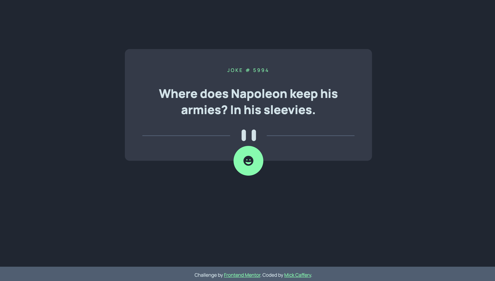
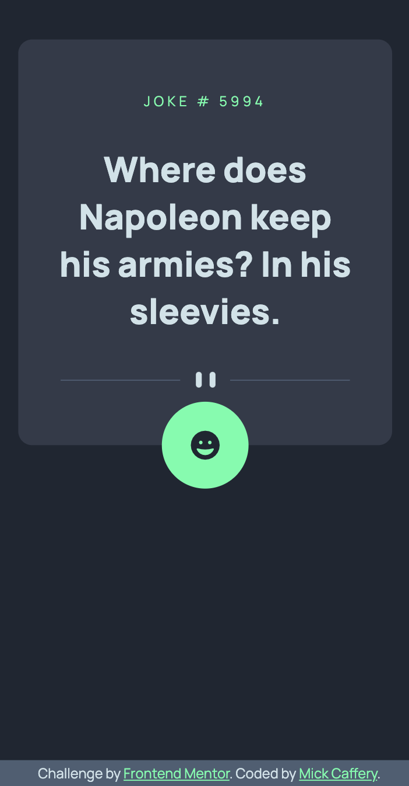

# Frontend Mentor - Joke generator app solution

This is a solution to the [Advice generator app challenge on Frontend Mentor](https://www.frontendmentor.io/challenges/advice-generator-app-QdUG-13db). I switched the advice API for a dad jokes API, just to make it a bit more fun. Link to the API is below in the Useful Resources section.

#### Link

- My Solution Live Site URL: [https://www.frontendmentor.io/challenges/advice-generator-app-QdUG-13db](https://www.frontendmentor.io/challenges/advice-generator-app-QdUG-13db)

## Table of contents

- [Frontend Mentor - Joke generator app solution](#frontend-mentor---joke-generator-app-solution)
      - [Link](#link)
  - [Table of contents](#table-of-contents)
  - [Overview](#overview)
    - [The challenge](#the-challenge)
    - [Screenshot](#screenshot)
  - [My process](#my-process)
    - [Built with](#built-with)
    - [What I learned](#what-i-learned)
    - [Continued development](#continued-development)
    - [Useful resources](#useful-resources)
  - [Author](#author)

## Overview

### The challenge

Users should be able to:

- View the optimal layout for the app depending on their device's screen size
- Generate a new joke by clicking the button

### Screenshot

Desktop View

Mobile View

## My process

### Built with

- Semantic HTML5 markup
- CSS custom properties
- Mobile-first workflow
- Fetch API

### What I learned

This was the first Front-End Mentor challenge that I implemented with JavaScript.
My major learnings with this challenge were about:
- Fetch API
- Async & Await (Promises)
- Adding Event Listeners

### Continued development

- I'll continue to learn about connecting to third-party APIs.
- I'm currently learning about implementing drag and drop features with DOM manipulation
- In the next few weeks I'll start to learn React.

### Useful resources

- [Dad Jokes API](https://icanhazdadjoke.com/) - This is the API I used to receive the dad jokes - https://icanhazdadjoke.com/

## Author

- GitHub - [Mick Caffery](https://github.com/mickcaff)
- Frontend Mentor - [@mickcaff](https://www.frontendmentor.io/profile/mickcaff)
- [LinkedIn](https://www.linkedin.com/in/mcaffery/)
